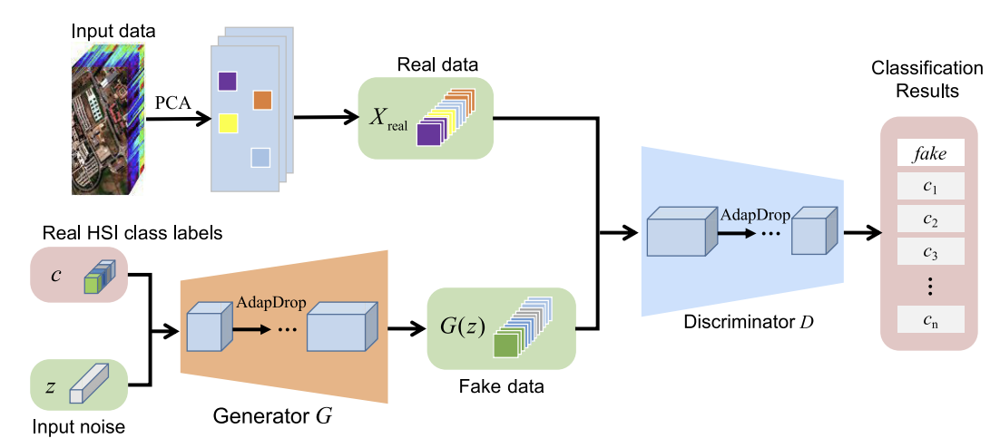

# `Synthesis of Hyperspectral Skin Lesion Images for Data Augmentation using Generative Models`
# `Síntese de um Dataset Hiperespectral de Lesões de Pele utilizando IA Generativa `

## Presentation

This project originated in the context of the graduate course *IA376N - Generative AI: from models to multimodal applications*, 
offered in the second semester of 2025, at Unicamp, under the supervision of Prof. Dr. Paula Dornhofer Paro Costa, from the Department of Computer and Automation Engineering (DCA) of the School of Electrical and Computer Engineering (FEEC).

|Name  | RA | Specialization|
|--|--|--|
| Kristhian André Oliveira Aguilar  | 298976  | Computer Engineering|
| Ana Clara Caznok Silveira  | 231745  | Computer Engineering|
| Aline Yoshida Machado | 265732 | Biomedical Physics|

## Project Summary Description
Hyperspectral Imaging (HSI) combines imaging and spectroscopy, giving each pixel a continuous spectrum across wavelengths. HSI captures how light interacts with molecules, as their composition, vibrations, and structure affect photon behavior. These light–matter interactions create distinct spectral patterns that act like unique “fingerprints” for each material. Thanks to its ability to distinguish different materials, tissues, and substances, Hyperspectral Imaging (HSI) has become a valuable tool in Remote Sensing, Agriculture, and Medicine. In medicine, its capacity to go beyond standard RGB imaging is mainly used to detect tumors. However, publicly available hyperspectral tumor datasets are scarce, which often leads classification models to overfit or perform poorly in subsampled classes.

### Main goal
Therefore, the main goal of this project is to construct a generative ai model that learns the distribution of real hyperspectral images and through them is able to create a synthetic hyperspectral medical dataset. 
Desired output: a synthetic hyperspectral dataset of skin lesions and melanoma. 

### Presentation
> Include in this section a link to the presentation video of the project proposal (maximum 5 minutes).

## Proposed Methodology
> For the first submission, the proposed methodology must clarify:  
> * Which dataset(s) the project intends to use, justifying the choice(s).
> * Which generative modeling approaches the group already sees as interesting to be studied.  
> * Reference articles already identified and that will be studied or used as part of the project planning.  
> * Tools to be used (based on the group’s current vision of the project).  
> * Expected results.  
> * Proposal for evaluating the synthesis results.
### Tools to be used
The project will be developed using Python, with the following libraries:
- TensorFlow/Keras or PyTorch for building and training the generative models.
- NumPy, Pandas and matplotlib for data exploration, manipulation and analysis.
- Scikit-learn for implementing classic machine learning algorithms and evaluation metrics.
- OpenCV and PIL for image processing tasks.
- Jupyter Notebooks for experimentation.
- [pytorch-lightning-template](https://github.com/DavidZhang73/pytorch-lightning-template/tree/main) to structure the code in a modular and organized way. This template includes:
  - `wandb` for experiment tracking and visualization.
  - `hydra` for configuration management.
  - `pytorch-lightning` for simplifying the training loop and model management.
  - `torchmetrics` for easy access to common metrics.

### Generative Models

#### 3D-GAN
- The input of the discriminator are HSI images with spacial and spectral information. Initially the spectral bands are reduced using PCA preserving the top 3 components that retain most spectral energy while keeping spatial information  
- The generator's inputs a random noise vector `z` plus class label `c` and outputs a synthetic spectral–spatial patches shaped like real HSI data after PCA. Its architecture is composed by convolutional layers and batch normalization layers  
- The discriminator recieves the real and fake images, outputs a sigmoid classifier to distinguish real vs. fake and a softmax classifier to predict the class of the input patch  

#### AD-GAN
This GAN is similar to 3D-GAN's structure, however there are two modifications:
1. Uses Adaptive DropBlock (AdapDrop) as regularization to avoid overfitting and improve diversity
2. discriminator D has one output that returns either a specific class c or the fake label

#### Autoencoder
- The autoencoder is composed by an encoder and a decoder. The encoder compresses the input HSI image into a lower-dimensional latent representation, while the decoder reconstructs the original image from this representation.
- A variational autoencoder (VAE) is a type of autoencoder that learns a probabilistic mapping from the input data to a latent space, allowing for the generation of new samples by sampling from this latent space.
- VAEs are especially adept at modeling complex, high-dimensional data and continuous latent spaces, making them extremely useful for tasks like generating diverse sets of similar images.
- Palsson et al. [2] used a VAE paired with a GAN framework to generate high-resolution synthetic hyperspectral images.
- Liu et al. [3] proposed a model inspired autoencoder (MIAE) to fuse low-resolution HSI with high-resolution RGB images to generate high-resolution HSI.

### Evaluating synthesis results
We would like for the generated images to be: clear, realistic and useful. 
- Image Clarity/Quality : Variance, Spatial and Spectral Entropy, SNR
- Image realism : Spectral Angle Mapper for average melanoma spectral signature , SSIM with real images
- Usability: Given a baseline classifier that classifies images into melanoma and not melanoma, first train the classifier with only real data then with real + synthetic data and see if F1 score improves. Then, train only on synthetic data and test on real data to see if classifier performs similarly 

## Schedule

## Bibliographic References
1. D. A. Abuhani, I. Zualkernan, R. Aldamani and M. Alshafai, "Generative Artificial Intelligence for Hyperspectral Sensor Data: A Review," in IEEE Journal of Selected Topics in Applied Earth Observations and Remote Sensing, vol. 18, pp. 6422-6439, 2025, doi: https://doi.org/10.1109/JSTARS.2025.3538759.
2. Palsson, Burkni, Magnus O. Ulfarsson, and Johannes R. Sveinsson. 2023. "Synthesis of Synthetic Hyperspectral Images with Controllable Spectral Variability Using a Generative Adversarial Network" Remote Sensing 15, no. 16: 3919. https://doi.org/10.3390/rs15163919
3. Liu, J., Wu, Z., Xiao, L., & Wu, X. J. (2022). Model Inspired Autoencoder for Unsupervised Hyperspectral Image Super-Resolution. IEEE Transactions on Geoscience and Remote Sensing, 60, 1-12. https://doi.org/10.1109/tgrs.2022.3143156
